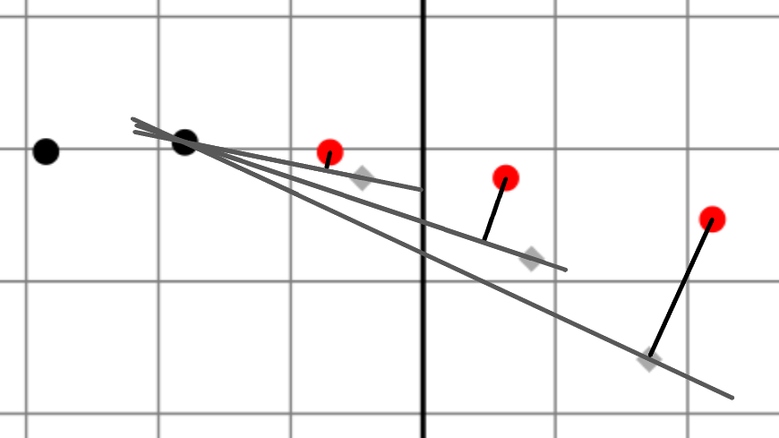
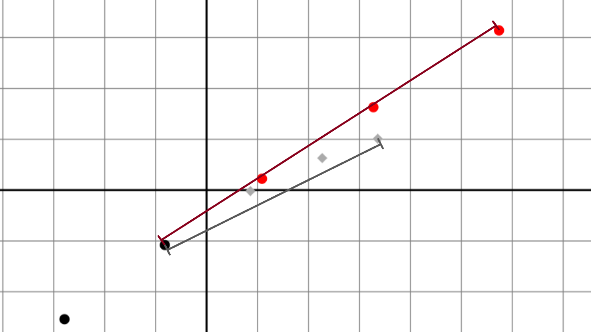
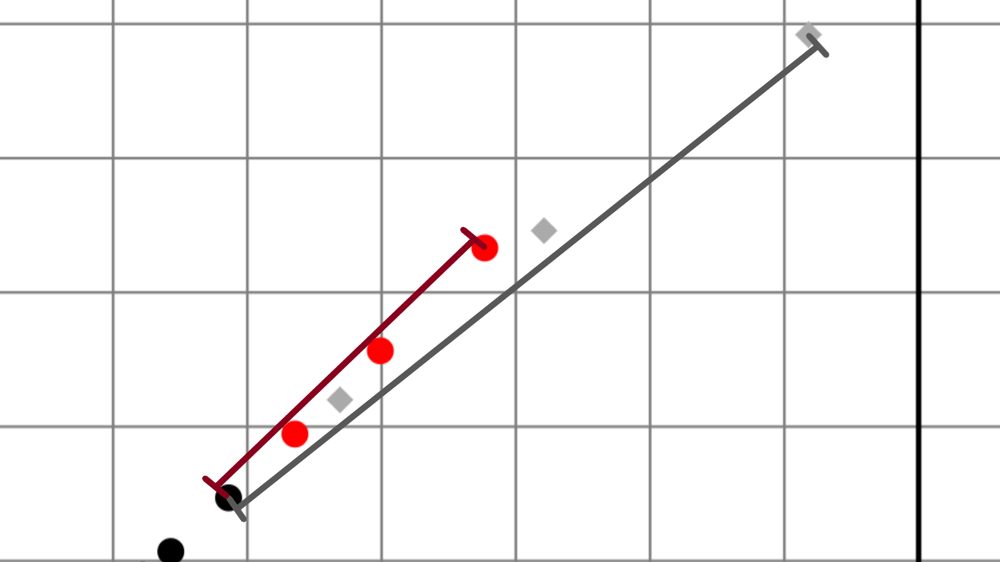

# Background

Input position prediction is part of the effort to reduce rendering latency.  Accuracy of prediction is currently being evaluated as the distance from a predicted point to its respective real point. This provides a measurement of how far apart the real and predicted event are, but it does not evaluate whether the prediction would have resulted in a better or worse experience.  Specifically, with the current metric, all predicted events at the same radius from their corresponding real event are considered equally good. This document proposes an additional set of metrics that can differentiate the quality of predictions based on which ones are more likely to result in user perceivable anomalies.

An additional issue, though currently out of scope for this proposal, is that accuracy of prediction is being computed just before a new stream of coalesced events gets fed into the prediction model, by generating a prediction for each event in the stream using its timestamp. This means that there’s discrepancy between the recorded quality of the prediction and the user’s perception of the quality of the prediction, given that the latter is not being evaluated.

# Metrics

The purpose of the metrics is to track the anomalies that were found to have a correlation with user dissatisfaction during user studies.
During this explanation, the following expressions will be used:
* Rn: Real events that have been already used as input for prediction. These will be represented by black circles in the image examples.
* Pn+x: Predicted events that were generated based on real events. These will be represented by red circles in the image examples.
* Fn+x: Future real events that have not been processed and will be used for accuracy evaluation. These will be represented by grey diamonds in the image examples.

## Deviation

Deviation happens whenever the predicted events follow a different trajectory than the one of the future events. It is produced by computing the distance between the predicted event Pn+x and the straight line that goes through real event Rn and the future event Fn+x.

This anomaly is most perceivable in scenarios where prediction is used to extend the input but is later replaced by the real input. In inking, for example, it is very noticeable whenever the prediction deviates because the next input segment immediately corrects the stroke. Other type of scenarios would present a less perceptible symptoms. Panning, for instance, would produce a zigzagging movement instead of a smooth one.

Figure 1: Black:Real; Grey:Future; Red:Predicted

## Overshoot

Overshoot happens when a predicted event is generated further than where it should have been. This metric is produced by evaluating the difference of the distance between the real event Rn and predicted event Pn+x and the distance between the real event Rn and future event Fn+x when prediction distance is greater than the future distance.

The inking experience greatly affected by this anomaly, because it traverses the ink segment a considerable amount per the overshot points, but then it is pulled back to its correct distance given that the next prediction does not suffer from this error. Panning and scrolling have some measures to prevent the rubber banding effect by blocking backtrack, but this produces a jagged movement.

Figure 2: Black:Real; Grey:Future; Red:Predicted

## Undershoot

Contrary from overshoot, undershoot occurs when the projected distance of the prediction was not enough. It evaluates the difference of the distance between the real event Rn and predicted event Pn+x and the distance between the real event Rn and future event Fn+x when real future distance is greater than the prediction distance.

Undershoot affects the reduction of perceived latency, or rather, that reduction is not as much as it could be given the amount of time into the future that’s being predicted. This symptom is not very perceivable and might be produced in some cases by design as a mechanism to prevent overshoot.

It’s important to consider that high variance between undershoot and overshoot generates a bad experience in any kind of scenario that does not have any measures against rubber banding.

Figure 3: Black:Real; Grey:Future; Red:Predicted

